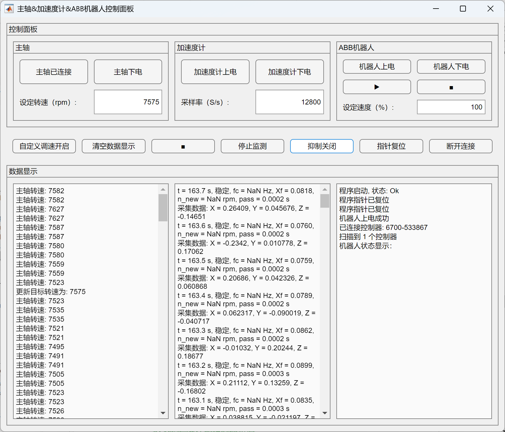

# CNC-Robot-THU
Robotic Machining System @Tsinghua: Custom ABB IRB6700 (2.6m reach, 200kg load, avg. 0.29mm accuracy), high-speed spindle, Siemens PLC, RealSense depth camera, CHOTEST auto-probing, vision-based tool setting. Developing AI-powered CAM, C++ ROS integration, and KUKA KR-60 collaboration.

✨ 项目简介
------
清华大学深圳国际研究生院 LIMES 实验室机器人加工系统 | Robotic Machining System from Tsinghua SIGS LIMES  

本项目围绕**机器人加工系统**的搭建与控制展开，基于ABB IRB6700机器人（2.6m臂展，200kg负载，平均绝对精度0.29 mm），集成西门子PLC、高速电主轴、RealSense视觉系统、CHOTEST自动测量探头，并融合了ROS生态、视觉识别、加工颤振在线监测与自适应变主轴转速抑制技术。

* * *

> 📌 **机器人加工系统功能演示**：

<!-- 直接在README页面内展示的GIF动图 -->

<!-- 外部链接，用户点击可跳转观看完整分辨率视频 -->
🎬 [Full Resolution Video](https://drive.google.com/file/d/1IW6d7zLTxaNsqKViqW-QUM10UKJw6B21/view)

* * *

🚩 仓库结构说明
---------

### 📂 [`Codes/`](Codes/)

* **[`Robotic_Milling_Necessities`](Codes/Robotic_Milling_Necessities)**：  
机器人加工相关控制程序及铣削实验数据分析代码。

基于MATLAB R2023a的机器人上位机控制软件，最重要程序为：[**`m058_UpdateOnce_accXYZ_ABBcontrol_NI_Spindle_TCPIP_GUI_04.m`**](Codes/Robotic_Milling_Necessities/EXP04_机器人加工系统上位机控制程序_m058_UpdateOnce是最终版_20250407/m058_UpdateOnce_accXYZ_ABBcontrol_NI_Spindle_TCPIP_GUI_04.m)，位于[`EXP04`文件夹](Codes/Robotic_Milling_Necessities/EXP04_机器人加工系统上位机控制程序_m058_UpdateOnce是最终版_20250407)中，另需以下三个函数置于同一目录：
- [`f020_read_timeStamps_accX_spinSpeed_from_txt_04.m`](Codes/Robotic_Milling_Necessities/EXP04_机器人加工系统上位机控制程序_m058_UpdateOnce是最终版_20250407/f020_read_timeStamps_accX_spinSpeed_from_txt_04.m)
- [`f060_Decision_fft_filter_report.m`](Codes/Robotic_Milling_Necessities/EXP04_机器人加工系统上位机控制程序_m058_UpdateOnce是最终版_20250407/f060_Decision_fft_filter_report.m)
- [`f070_NewSpinSpeed_04.m`](Codes/Robotic_Milling_Necessities/EXP04_机器人加工系统上位机控制程序_m058_UpdateOnce是最终版_20250407/f070_NewSpinSpeed_04.m)

> 📌 本程序是首个**基于MATLAB调用ABB PC SDK的机器人二次开发控制界面**（传统方案通常使用C#）。  
> 当前版本成功实现机器人（ABB IRB6700 200/2.6）上下电、指针复位、运行例行程序及启停控制，经真机测试运行稳定可靠。  
> 经测试发现加入ABB PC SDK其他功能（如读写变量、编程等）后界面存在明显卡顿，推测为ABB SDK本身性能瓶颈所致，建议编程、变量修改等复杂任务在RobotStudio内完成。

<!-- 软件运行颤振时截图（软件界面） -->

<!-- -->

其他文件夹（如`EXP01`~`EXP09`及`EXPpre`系列）为机器人铣削实验及数据分析代码，非机器人加工方向研究者可忽略。

基于C#的机器人上位机控制软件位于[`ABB_CSharp上位机_优化卡顿_取消监听_20250318`](Codes/Robotic_Milling_Necessities/PLC_CSharp上位机_20250113/ABB_CSharp上位机_优化卡顿_取消监听_20250318)文件夹，下载整个文件夹，用Visual Studio打开[`ABB_1230.sln`](Codes/Robotic_Milling_Necessities/PLC_CSharp上位机_20250113/ABB_CSharp上位机_优化卡顿_取消监听_20250318/20250114/ABB_12301/ABB_1230.sln)即可运行（实际运行容易卡顿或出现bug）。

整套机器人加工系统的核心PLC程序位于[`4_20250114_还差机器人转速设置`](Codes/Robotic_Milling_Necessities/PLC_CSharp上位机_20250113/4_20250114_还差机器人转速设置)文件夹内：[**`THU_LIMES_RoboticMillingSystem_Finish_20250113_V18.ap18`**](Codes/Robotic_Milling_Necessities/PLC_CSharp上位机_20250113/4_20250114_还差机器人转速设置/THU_LIMES_RoboticMillingSystem_Finish_20250114_V18/THU_LIMES_RoboticMillingSystem_Finish_20250113_V18.ap18)。使用西门子TIA博途V18版本，功能包括：主轴转速监测、主轴启停与转速控制信号发送、气动系统控制（拉刀、换刀、气密、中心吹尘）及加工状态三色灯控制等。

* **[`ROS_Vision`](Codes/ROS_Vision)**：  
ROS与视觉系统相关程序（由吴珩管理）。

---

### 📂 [`Docs/`](Docs/)

* **[机器人加工系统颤振监测与抑制技术研究（朱镇硕士学位论文）](Docs/11_毕业论文pdf_2022214656-朱镇-机器人加工系统颤振监测与抑制技术研究_20250517.pdf)**  
工业机器人刚度不足导致铣削易发生颤振，影响加工质量与稳定性。本文建立机器人铣削的动力学模型，通过稳定性叶瓣图指导颤振监测与抑制策略设计；研发了基于FFT频谱分析和频域陷波滤波的颤振实时监测方法，并提出自适应变主轴转速主动抑制策略。实验表明颤振检测延迟低于100 ms，主动抑制策略150 ms内生效，有效降低振幅超过80%，显著提升加工稳定性和零件质量。  
实验结果表明，该方法将加工效率提升超过30%，工件表面质量提高约60%，刀具寿命显著延长。

---

### 📂 [`Media/`](Media/)

* 项目相关图片、视频和展示GIF文件，用于项目说明与演示。

* * *

🛠️ 核心技术亮点
----------

- **机器人视觉辅助**：RealSense视觉系统自动识别工件位置；
- **自动标定系统**：CHOTEST探头自动建系与视觉对刀；
- **颤振在线监测与主动抑制**：基于FFT频谱分析的实时监测及变主轴转速自适应控制；
- **ROS生态融合**：基于C++开发ROS接口；
- **前沿探索**：AI驱动的CAM路径规划与加工特征识别（开发中）。
  

* * *

🚀 项目维护者
--------

[朱镇 (Zhen Zhu)](https://zhenzhuzz.github.io), 吴珩 (Heng Wu)   
[清华大学 深圳国际研究生院 LIMES 实验室](http://www.thume.impmlab.com/)

